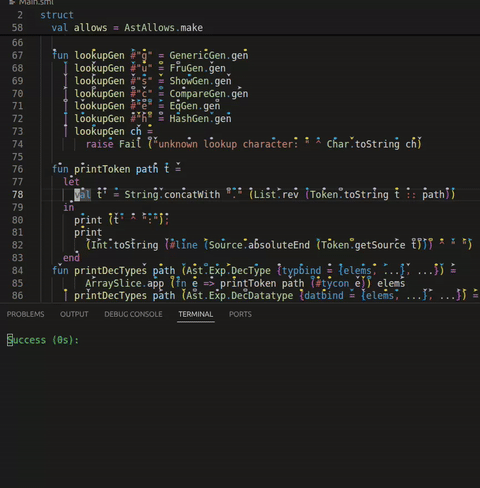

mltonid
=======



Watches an MLB (ML Basis) file and typechecks the project whenever a file contained in the MLB changes. The type environments for unchanged MLBs are cached making subsequent typechecks faster and more scalable over larger projects.

For example,
this project takes around 9s to typecheck with `mlton -stop tc` on my computer, and although the initial typecheck takes around that long, the subsequent typechecks take around 2-4s for modifying
`src/mltonid/structs.sml` which generates most of MLton's structures, and around 0-1s for modifying `src/mltonid/main.sml` which contains the main program. The more you
"modularize" your project by creating multiple MLB files the more improvements you can get when typechecking with `mltonid`.

`mltonid` reuses most of MLton's frontend, which means things like `(*#showBasis "file.basis"*)` comments in the code will still generate a `file.basis` file that can be consumed by various IDE-like tools. `mltonid` also emits pattern match exhaustiveness warnings although it does the checking directly on the `CoreML`.

Building:
---------

Building with MLton:

```
mlton mltonid.mlb
```

Building with Poly/ML:

```
./build_polyml.sh
polyc build.sml -o mltonid
```

MLton files are required to be in a standard location like `/usr/local/lib/mlton`.

Building with SML/NJ:

```
ml-build mltonid.cm Main.main mltonid
sml @SMLload=mltonid.amd64-linux <args>
```

Where `amd64-linux` is replaced with your architecture.

Running:
--------

To run mltonid on an MLB file, run:

```
mltonid file.mlb
```

A local build of MLton is required in order to
pull the target specific types and constants. The MLton specific paths needed by mltonid are configured by setting environment variables. The environment variables expected are:

| Required | Variable      | Value |
|----------|---------------|-------|
| Yes      | SML_LIB       | `<mlton_install_dir>/sml` (Example: `/usr/local/lib/mlton/sml`) |
| Yes      | LIB_MLTON_DIR | `<mlton_build_dir>/build/lib/mlton` (Example: `/home/user/mlton/build/lib/mlton`) |
| No       | TARGET        | `self` (default) |

TODO:
-----

* Use inotify for faster file watching
(currently the files are polled every second)
* Don't propagate reelaboration to users of an MLB file if the MLB didn't change its exported signatures
* Store typechecked MLB signatures on disk for potentially faster
initial elaboration times